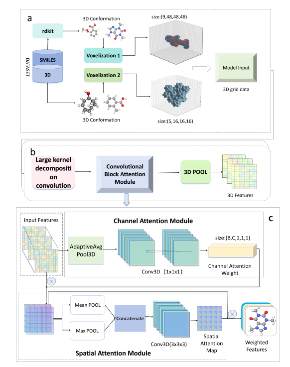

# 🧬 Prop3D: Geometry-enhanced Representation Learning Model for Molecular Property Prediction
## 📖 Introduction

**Prop3D** is a molecular representation learning model based on **3D convolutional neural networks (3D-CNNs)**, designed to more effectively leverage the three-dimensional geometric structure of molecules for property prediction. By optimizing the decomposition of large convolutional kernels, Prop3D reduces computational overhead while enhancing modeling capacity. It also incorporates an attention mechanism to better focus on key structural features. Experimental results show that Prop3D consistently outperforms mainstream methods across various molecular property prediction tasks, demonstrating strong performance and broad applicability.



## 📝 Key Contributions

1. Modeling molecular data as 3D grids.
2. Proposed a representation learning model for molecular property prediction called Prop3D.
3. Introduced the large kernel decomposition strategy into molecular representation learning.
4. Achieved significant performance improvements on multiple public datasets.

## 🚀 Quick Start
### 1. Set up the environment

```bash
conda create -n Prop3D python=3.9
conda activate Prop3D
pip install -r requirements.txt
```

###  2.Dataset Download Instructions

1.QM9:Source: [Atom3D - QM9 Dataset](https://www.atom3d.ai/smp.html)

2.ESOL Freesolv Tox21:Source: [Drug3D-Net GitHub](https://github.com/anny0316/Drug3D-Net)

### 3.Model Training and Evaluation
This project supports training and evaluation on four widely-used molecular datasets:

| Dataset    | Type            | Task                          | Script         |
|------------|-----------------|-------------------------------|----------------|
| QM9        | Regression       | Quantum chemistry properties  | `3dcnntrain.py` |
| ESOL       | Regression       | Aqueous solubility prediction | `esol.py`       |
| FreeSolv   | Regression       | Hydration free energy         | `freesolv.py`   |
| Tox21      | classification | Toxicity classification (12 tasks) | `Tox21.py`      |


