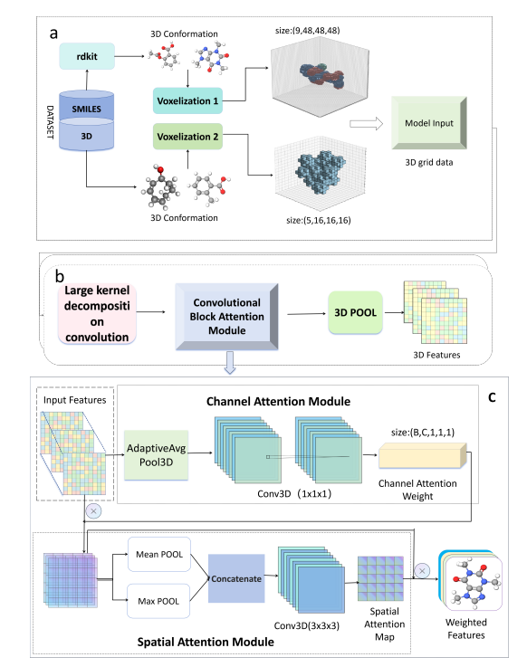

# 🧬 Prop3D: Geometry-enhanced Representation Learning Model for Molecular Property Prediction
## 📖 abstract
Molecular representation learning (MRL) has demonstrated significant potential in various fields such as drug discovery, particularly in extracting molecular features under limited supervision. However, most existing approaches rely on one-dimensional sequences or two-dimensional topological structures, which fail to adequately capture the complexity of molecular three-dimensional (3D) geometry, thereby limiting their performance in complex property prediction tasks.
To more effectively model spatial structural information, three-dimensional convolutional neural networks have recently gained attention in MRL research due to their ability to directly process voxelized 3D molecular data. Nevertheless, these methods often suffer from severe computational inefficiencies caused by the inherent sparsity of voxel data, resulting in a large number of redundant operations. In addition, the commonly used large convolutional kernels—though beneficial for increasing model capacity—introduce substantial computational overhead, which restricts scalability in practical applications.
To address these challenges,  we propose Prop3D, an efficient 3D molecular representation learning model. Prop3D adopts a kernel decomposition strategy that significantly reduces computational cost while maintaining high predictive accuracy. Experimental results on multiple public benchmark datasets demonstrate that Prop3D consistently outperforms several state-of-the-art methods in molecular property prediction.




## 📝 Key Contributions

1. Modeling molecular data as 3D grids.
2. Proposed a representation learning model for molecular property prediction called Prop3D.
3. Introduced the large kernel decomposition strategy into molecular representation learning.
4. Achieved significant performance improvements on multiple public datasets.

## 🚀 Quick Start
### 1. Set up the environment

```bash
conda create -n Prop3D python=3.9
conda activate Prop3D
pip install -r requirements.txt
```

###  2.Dataset Download Instructions

1.QM9:Source: [Atom3D - QM9 Dataset](https://www.atom3d.ai/smp.html)

2.ESOL Freesolv Tox21:Source: [Drug3D-Net GitHub](https://github.com/anny0316/Drug3D-Net)

### 3.Model Training and Evaluation
This project supports training and evaluation on four widely-used molecular datasets:

| Dataset    | Type            | Task                          | Script         |
|------------|-----------------|-------------------------------|----------------|
| QM9        | Regression       | Quantum chemistry properties  | `train.py` |
| ESOL       | Regression       | Aqueous solubility prediction | `esol.py`       |
| FreeSolv   | Regression       | Hydration free energy         | `freesolv.py`   |
| Tox21      | classification | Toxicity classification (12 tasks) | `Tox21.py`      |


